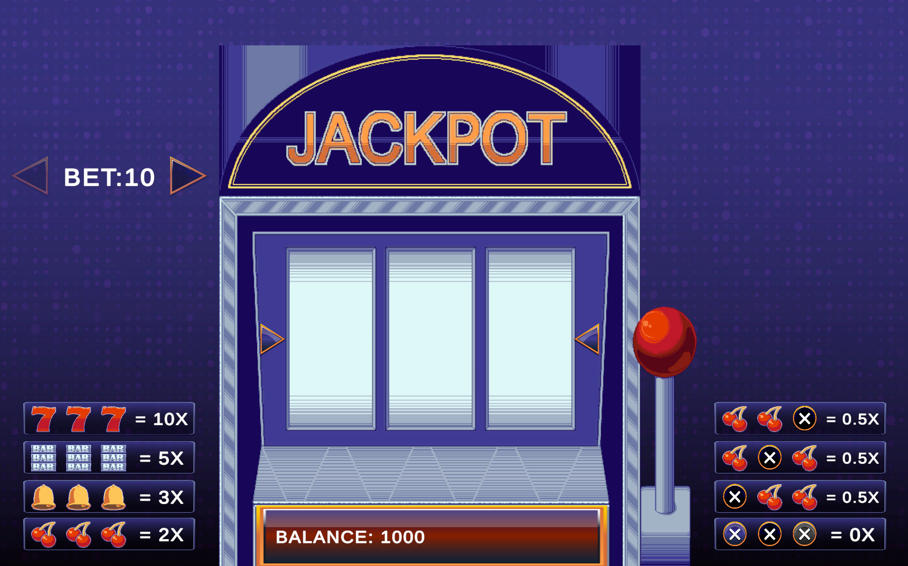
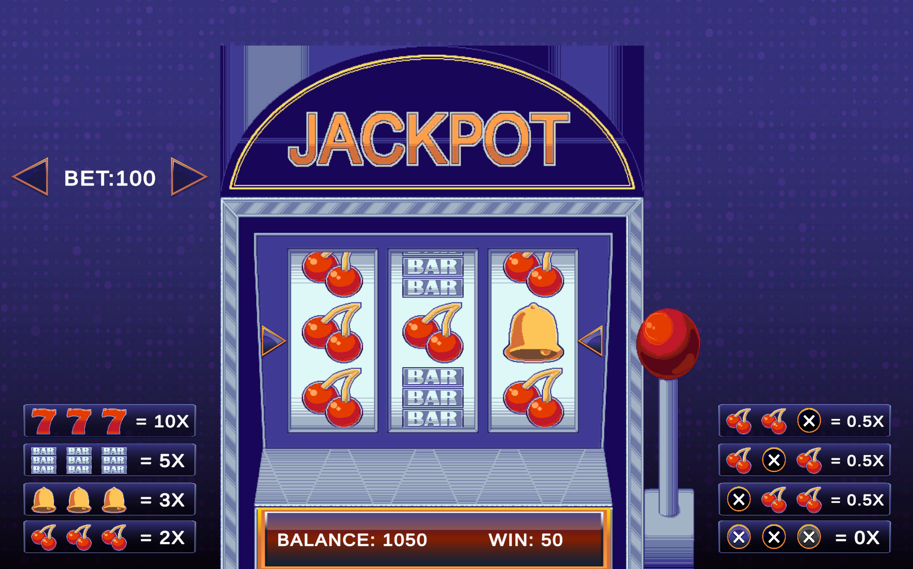
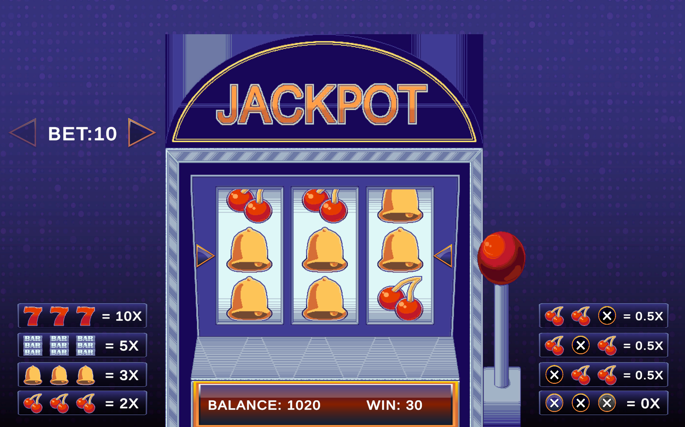
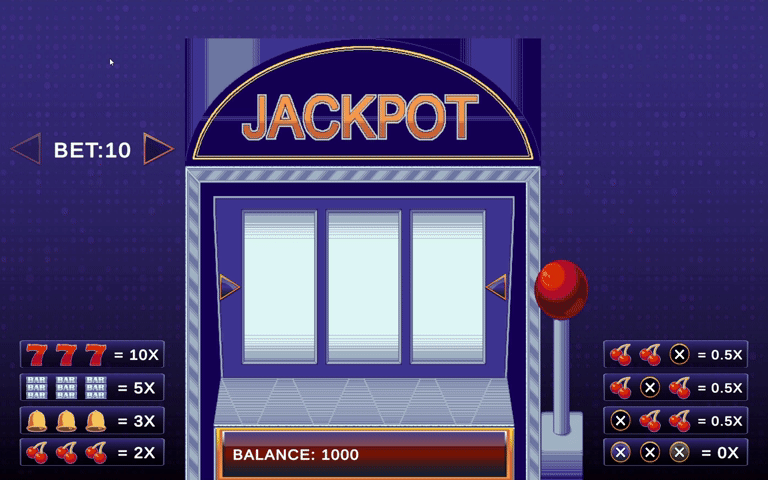

# Lucky Pull

A 3-reel, single-payline slot machine built in Unity 6000.3.10f1. Pull the lever to spin, adjust your bet between three tiers, and try to land three matching symbols on the payline.

## Screenshots

| | | |
|---|---|---|
|  |  |  |
| Idle | Cherries win (2x) | Jackpot — Triple 7 (10x) |

## Gameplay Preview

## How to Run the WebGL Build

1. Clone this repo
2. Serve the `Build/WebGL/` folder locally (e.g. `python -m http.server` from inside that folder)
3. Open the served `index.html` in a browser

(Note: opening `index.html` directly via `file://` will not work due to browser CORS restrictions on WebGL's binary files — it must be served over HTTP.)

## Controls

- Click the lever to spin
- Bet +/- buttons change your wager between 10 / 50 / 100 credits
- Wins are shown inline next to the reels (`WIN: X`)
- If you run out of credits, a popup asks whether to reset your balance and keep playing

## Payouts

Win condition: the middle row of all 3 reels lands on the same symbol.

| Symbol | Payout |
|---|---|
| 7 | 10x bet |
| BAR | 5x bet |
| Bell | 3x bet |
| Cherries | 2x bet |

**Consolation rule:** if the payline isn't a full match but 2 or more reels land on Cherries, that still pays 0.5x the bet.

## Bonus Features

- Cherries consolation payout: landing 2+ Cherries on the payline (without a full 3-of-a-kind match) still pays 0.5x the bet.

## Thought Process / Approach

The brief left reel count, symbol count, and payline structure open, so those were the main design calls to make:

- **3 reels, single payline (middle row).** The brief's win condition — "all slots have the same symbol" — reads most naturally as one payline across three reels rather than a full grid match, so that's what this implements. Each reel still displays 3 stacked symbols for scroll feel, but only the middle row is evaluated for a win.
- **4 tiered symbols (7, BAR, Bell, Cherries)**, each with its own spawn weight and payout multiplier, so the odds and payouts scale together the way real slot machines do — rarer symbols pay more.
- **The lever is the spin trigger**, not a plain button. The provided art included two lever poses (rest/pulled), so wiring the actual pull motion into the interaction felt truer to the "smooth reel animations / game feel" evaluation criterion than a generic button click would.
- **RNG is a shared weighted table across all three reels**, rolled independently per reel per spin, rather than per-reel custom virtual strips. Simpler to reason about and tune for a project this size; per-reel strip tuning (the way real machines control house edge) is a natural next step if this were taken further.
